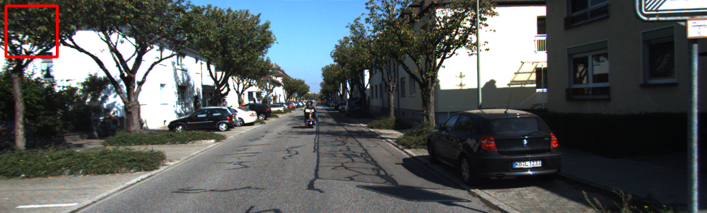

# PythonCpp_conv
Cpp함수에서 Python함수의 호출, mat을 numpy로 변환하는 코드입니다. 


## Requirement
```

OpenCV >=3.0

Python ==3.8 

```

## 빌드 방법

```
git clone https://github.com/JeonHyeongJunKW/PythonCpp_conv.git
cd PYTHONCPP_CONV
mkdir build
cd build
cmake ..
make
```

이렇게하면 Example1 과 Example2 실행파일이 생성됩니다. 

## 사용법

### Example1 
: 숫자 두개와 파이썬 파일(sum_worker)의 폴더위치를 인자로받습니다.

행동 : 숫자 두개의 합을 정수로 반환합니다.
ex) in build
```
./Example1 1 2 ../Example1/
---------------------------------------
> 결과는 3입니다.
```

### 설명 : PyObject를 이용하여 간단하게 c++코드에서 'sum_worker' 파이썬 파일의 내장함수를 받은 결과를 출력합니다.

<br>

### Example2
: 칼라이미지와 그레이 이미지 2장의 경로와 파이썬 파일(mat_worker)의 폴더위치를 인자로받습니다.

※ 주의 : 칼라이미지와 그레이이미지 순서대로 넣어야하고, 110*110보다는 이미지가 커야합니다.

행동 : 그림의 좌측에 (10,10)위치부터 100*100짜리 네모가 그려집니다.

ex) in build
```
./Example2 ../Sample/color.png ../Sample/gray.png ../Example2/

```
<출력된 이미지>



### 설명 : PyObject를 이용하여 Mat을 Numpy Array로 바꾸고, Python에서 네모를 그리고, Numpy Array를 Mat으로 다시 바꿔서 출력합니다. 코드 자체가 unsigned char 타입의 이미지만 가능하도록 설계되있습니다.

<br>

